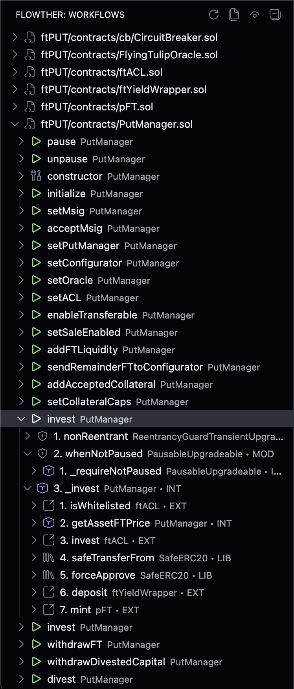
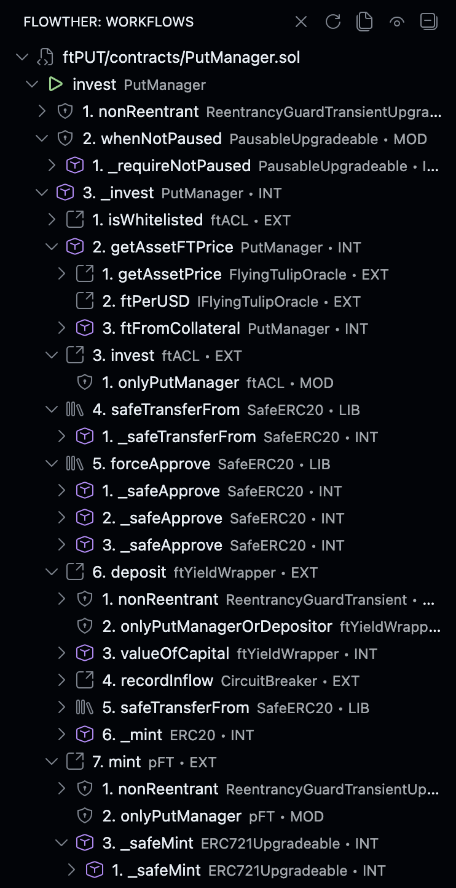

<p align="center">
  
</p>

# Flowther (VSCode extension)

Flowther shows **state-changing entry points** in a Solidity workspace and renders their **call graphs** as an interactive tree.

## Screenshots

**Default panel view**



## Features

- Groups workflows by **file**
- Entry points = `public`/`external` functions that are **not** `view`/`pure` + `constructor`/`receive`/`fallback`
- **Inherited functions** from abstract contracts are shown in concrete contract files with dimmed `from ContractName` indicator
- Call trees preserve **execution order** (including repeated calls) and include modifier/base-constructor paths
- Interface/abstract targets are resolved to concrete `override` implementations when possible
- Click any node to jump to its definition (or to the callsite when no definition exists, e.g. `abi.encode`, `keccak256`, `bytes.concat`)
- Jump highlights the target line for ~0.5s
- Right click an entry point to **Hide Flow**
- Right click an entry point to **Show Only This Flow** (focus mode)
- Right click a file to **Hide File** or **Unhide All Flows In File**
- Call nodes show icons + call-type badges, and can optionally display call order numbers

**Show Only This Flow (focus mode)**



## Installation

```bash
git clone https://github.com/nisedo/Flowther.git && cd Flowther && npx @vscode/vsce package && code --install-extension flowther-*.vsix
```

## Requirements

- **Slither** - one of:
  - Slither installed in your Python environment (`uv pip install slither-analyzer`)
  - [uv](https://docs.astral.sh/uv/) installed (Flowther will use `uvx --from slither-analyzer` automatically)
  - [pipx](https://pipx.pypa.io/) installed (Flowther will use `pipx run --spec slither-analyzer` automatically)
- A working Solidity build setup (e.g. Foundry/Hardhat/Truffle/Brownie) or `solc` for single-file analysis

## Usage

1. Open a Solidity workspace in VSCode
2. Open the **Flowther** activity bar icon → **Workflows**
3. Run **"Flowther: Refresh Workflows"** (command palette) if it doesn't auto-load

## Settings

- `flowther.targetPath`: optional analysis target inside the workspace (useful for monorepos / nested Foundry/Hardhat projects). Can be a Solidity file or a project root; if empty, Flowther auto-detects a supported project in the workspace.
- `flowther.pythonPath`: python interpreter (leave empty to auto-detect from the `slither` CLI)
- `flowther.slitherRepoPath`: optional path to a Slither checkout (leave empty to use the installed `slither` python package)
- `flowther.solcPath`: optional `solc` path
- `flowther.solcArgs`: optional solc args string
- `flowther.filterPaths`: optional filter paths passed to Slither
- `flowther.excludeDependencies`: hide dependency-defined entrypoints (default `true`)
- `flowther.expandDependencies`: expand call graphs into dependency-defined functions (default `true`)
- `flowther.showCallOrderNumbers`: prefix call nodes with execution order (default `true`)
- `flowther.maxCallDepth`: call graph depth cap (default `10`)

## Troubleshooting

- **“Failed to import Slither”**: set `flowther.pythonPath` to the interpreter where `slither` is installed, or set `flowther.slitherRepoPath` to a Slither checkout.
- **“Invalid compilation: … is a directory”**: set `flowther.targetPath` to your Foundry/Hardhat/etc project root (folder containing `foundry.toml` / `hardhat.config.*`) or to a specific `.sol` file.
